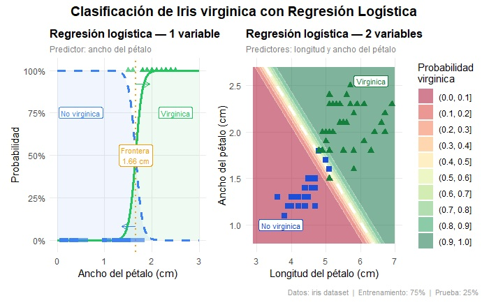
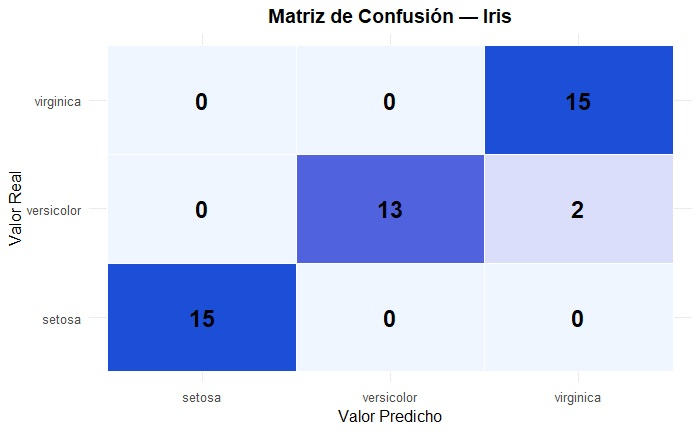
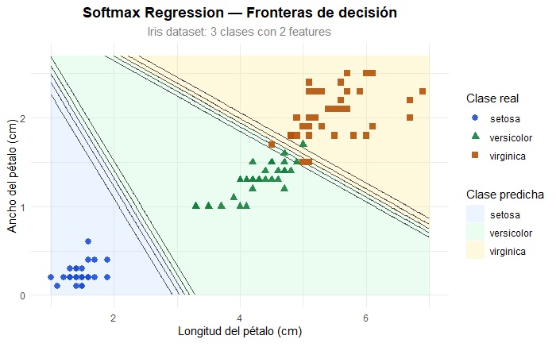

# Classification with Logistic Regression — Iris Dataset

> Practical Machine Learning exercise implemented in **R**, applying binary Logistic Regression and Softmax Regression to classify Iris flower species. Covers the full cycle: data exploration, theoretical foundation, implementation, visualization and evaluation.

---

## 1. Project Overview

Three progressive models were developed on the `iris` dataset (150 flowers, 3 species):

- **Binary model — 1 variable**: detect *Iris virginica* using only petal width
- **Binary model — 2 variables**: combine petal length and width to improve classification
- **Softmax Regression (multinomial)**: classify all three species simultaneously

---

## 2. Research Question and Problem Definition

**Can we predict the species of an Iris flower from physical petal measurements, using logistic regression as the classification model?**

The problem belongs to **supervised learning — classification**. Two versions were addressed:

- **Binary classification**: distinguish *Iris virginica* (positive class, label `1`) from the rest (negative class, label `0`)
- **Multiclass classification**: distinguish all three species simultaneously with Softmax Regression

Both are **linear classification** problems: the learned decision boundary is always a hyperplane. This is appropriate because the Iris dataset classes are approximately linearly separable in the petal feature space.

---

## 3. Data Collection and Preparation

### Dataset

The `iris` dataset is included in R base (`data(iris)`). No external download required.

| Feature | Detail |
|---|---|
| Instances | 150 flowers |
| Features | 4 continuous numeric variables |
| Classes | 3 species (50 instances per class) |
| Missing values | None |
| Source | `data(iris)` — R base |

### Variables

| Variable | Description | Type |
|---|---|---|
| `Sepal.Length` | Sepal length (cm) | Continuous numeric |
| `Sepal.Width` | Sepal width (cm) | Continuous numeric |
| `Petal.Length` | Petal length (cm) | Continuous numeric |
| `Petal.Width` | Petal width (cm) | Continuous numeric |
| `Species` | Flower species — **target variable** | Categorical (3 classes) |

### Preparation

```r
data(iris)

# Binary target variable
iris$es_virginica <- iris$Species == "virginica"

# 75/25 split with fixed seed for reproducibility
set.seed(42)
indices <- createDataPartition(y, p = 0.75, list = FALSE)
X_train <- X[indices, , drop = FALSE]
X_test  <- X[-indices, , drop = FALSE]
```

---

## 4. Exploratory Data Analysis (EDA)

The dataset is perfectly balanced (50 flowers per species), so there is no class imbalance to correct.

### Initial dataset view

```
   Sepal.Length  Sepal.Width  Petal.Length  Petal.Width  Species
1           5.1          3.5           1.4          0.2   setosa
2           4.9          3.0           1.4          0.2   setosa
3           4.7          3.2           1.3          0.2   setosa
```

Observed differences in petals by species:

- **Iris setosa**: very small petals (width: 0.1–0.6 cm). Easily separable from the rest.
- **Iris versicolor**: medium petals (width: 1.0–1.8 cm). Moderate overlap with virginica.
- **Iris virginica**: large petals (width: 1.4–2.5 cm). Overlap zone with versicolor between 1.4–1.8 cm.

Visual analysis confirms that the classes are **approximately linearly separable** in the `(Petal.Length, Petal.Width)` space, which justifies the use of logistic regression.

```r
head(iris, 3)        # first rows
summary(iris)        # descriptive statistics
table(iris$Species)  # class distribution → 50 of each
```

---

## 5. Model: Logistic Regression

### 5.1 Probability estimation

Instead of predicting a continuous value, logistic regression applies the **sigmoid function** $\sigma(\cdot)$ to transform the linear combination of features into a probability between 0 and 1:

$$\hat{p} = h_\theta(\mathbf{x}) = \sigma(\mathbf{x}^T \boldsymbol{\theta}) = \frac{1}{1 + \exp(-\mathbf{x}^T \boldsymbol{\theta})}$$

The sigmoid function has an S-shape: it returns values close to 0 for $z \ll 0$, close to 1 for $z \gg 0$, and exactly 0.5 when $z = 0$.

### 5.2 Prediction rule

$$\hat{y} = \begin{cases} 0 & \text{if } \hat{p} < 0.5 \\ 1 & \text{if } \hat{p} \geq 0.5 \end{cases}$$

The **decision boundary** is the set of points where $\mathbf{x}^T\boldsymbol{\theta} = 0$, which is a straight line in 2D (hyperplane in higher dimensions).

### 5.3 Cost function: Log Loss

The training objective is to find $\boldsymbol{\theta}$ that minimizes the **Log Loss** (binary cross-entropy):

$$J(\boldsymbol{\theta}) = -\frac{1}{m} \sum_{i=1}^{m} \left[ y^{(i)} \log\!\left(\hat{p}^{(i)}\right) + \left(1 - y^{(i)}\right) \log\!\left(1 - \hat{p}^{(i)}\right) \right]$$

There is no closed-form solution, but $J$ is **convex**: Gradient Descent guarantees finding the global minimum. The gradient with respect to parameter $\theta_j$ is:

$$\frac{\partial J}{\partial \theta_j} = \frac{1}{m} \sum_{i=1}^{m} \left( \sigma(\boldsymbol{\theta}^T \mathbf{x}^{(i)}) - y^{(i)} \right) x_j^{(i)}$$

> This expression has the same form as the gradient in linear regression: **prediction error** $(\hat{p} - y)$ multiplied by the feature value $x_j$.

### 5.4 Gradient derivation (chain rule)

The dependency chain is: $\theta_j \;\to\; z_i \;\to\; p_i \;\to\; \ell_i$

**Step 1** — derivative with respect to $p_i$:

$$\frac{\partial \ell_i}{\partial p_i} = \frac{p_i - y_i}{p_i(1 - p_i)}$$

**Step 2** — sigmoid derivative:

$$\frac{\partial p_i}{\partial z_i} = p_i(1 - p_i)$$

**Step 3** — applying the chain rule, the denominator cancels:

$$\frac{\partial \ell_i}{\partial z_i} = \frac{p_i - y_i}{p_i(1-p_i)} \cdot p_i(1-p_i) = p_i - y_i$$

**Step 4** — final result:

$$\frac{\partial \ell_i}{\partial \theta_j} = (p_i - y_i) \cdot x_{ij}$$

### 5.5 Regularization

To avoid overfitting, a penalty can be added to the cost function:

- **L2 (Ridge)**: adds $\lambda \sum_j \theta_j^2$ — shrinks coefficients without setting them to zero
- **L1 (Lasso)**: adds $\lambda \sum_j |\theta_j|$ — can drive coefficients to exactly zero (variable selection)

---

## 6. Softmax Regression (Multiclass)

Generalization of logistic regression to $K$ classes. For each class $k$, a linear score is computed:

$$s_k(\mathbf{x}) = \mathbf{x}^T \boldsymbol{\theta}^{(k)}$$

Each class has its own parameter vector $\boldsymbol{\theta}^{(k)}$, stored as rows of a parameter matrix $\boldsymbol{\Theta}$.

Scores are converted into probabilities using the **softmax function**:

$$\hat{p}_k = \frac{\exp(s_k(\mathbf{x}))}{\displaystyle\sum_{j=1}^{K} \exp(s_j(\mathbf{x}))}$$

This guarantees all probabilities are $\geq 0$ and sum to exactly 1.

**Numerical example** — if scores are $\mathbf{z} = [1.2,\ 2.0,\ 2.3]$:

$$e^{1.2} = 3.32, \quad e^{2.0} = 7.39, \quad e^{2.3} = 9.97 \quad \Rightarrow \quad S = 20.68$$

$$\text{softmax}(\mathbf{z}) = \left[\frac{3.32}{20.68},\ \frac{7.39}{20.68},\ \frac{9.97}{20.68}\right] = [0.16,\ 0.36,\ 0.48]$$

The prediction is the class with the highest probability:

$$\hat{y} = \underset{k}{\arg\max}\ \hat{p}_k$$

### Cost function: Multiclass Cross-Entropy

$$J(\boldsymbol{\Theta}) = -\frac{1}{m} \sum_{i=1}^{m} \sum_{k=1}^{K} y_k^{(i)} \log\!\left(\hat{p}_k^{(i)}\right)$$

where $y_k^{(i)} \in \{0, 1\}$ is the one-hot encoding of the true class. The gradient for each class $k$ is:

$$\nabla_{\boldsymbol{\theta}^{(k)}} J(\boldsymbol{\Theta}) = \frac{1}{m} \sum_{i=1}^{m} \left(\hat{p}_k^{(i)} - y_k^{(i)}\right) \mathbf{x}^{(i)}$$

---

## 7. Implementation in R

### Packages

```r
install.packages(c("tidyverse", "caret", "nnet", "patchwork"))
```

### Model 1 — Binary classification, 1 variable

```r
train_data <- data.frame(Petal.Width = X_train_vec, es_virginica = y_train)
modelo <- glm(es_virginica ~ Petal.Width, data = train_data, family = binomial)

# Probability for width = 1.67 cm
predict(modelo, newdata = data.frame(Petal.Width = 1.67), type = "response")
# → 0.5512  (55.1% probability of being virginica)

# Decision boundary
decision_boundary <- X_new[which(y_proba >= 0.5)[1]]
# → 1.6577 cm
```

### Model 2 — Binary classification, 2 variables

```r
modelo2 <- glm(es_virginica ~ Petal.Length + Petal.Width,
               data = train_data2, family = binomial)

# Linear decision boundary
coefs      <- coef(modelo2)
y_frontera <- -(coefs["Petal.Length"] * x_frontera + coefs["(Intercept)"]) /
               coefs["Petal.Width"]
```

### Model 3 — Softmax Regression

```r
modelo_softmax <- multinom(Species ~ Petal.Length + Petal.Width,
                            data = train_df, trace = FALSE)

# Prediction for petal 5 cm x 2 cm
predict(modelo_softmax,
        newdata = data.frame(Petal.Length = 5, Petal.Width = 2),
        type = "probs")
# setosa: ~0.0%  |  versicolor: ~5.8%  |  virginica: ~94.2%
```

---

## 8. Design Decisions

| Decision | Reason |
|---|---|
| `glm()` with `family = binomial` | Uses IRLS internally, equivalent to GD but more efficient and numerically stable |
| 75/25 split with `set.seed(42)` | Small balanced dataset; fixed seed guarantees reproducibility |
| Petal features only | Higher discriminative power than sepals |
| `multinom()` from nnet for multiclass | Implements softmax directly, more correct than one-vs-rest |
| Manually computed decision boundary | Allows understanding the underlying linear equation: $\theta_0 + \theta_1 x_1 + \theta_2 x_2 = 0$ |

---

## 9. Results

### 9.1 Logistic Regression — Probability curves and decision boundaries



**Interpretation:**

- **Left plot (1 variable — petal width):** The green curve represents the probability of being *Iris virginica* and the dashed blue curve the probability of not being so. Both follow the characteristic sigmoid shape. The decision boundary is located at **~1.66 cm**: above it the model classifies as virginica, below as non-virginica. The green triangles (virginica) and blue squares (non-virginica) show the actual data separation, with a visible overlap zone between 1.4–1.8 cm.

- **Right plot (2 variables — petal length and width):** The decision boundary becomes a **straight line** in the 2D plane (dashed line). The colored regions indicate the assigned probability: green for virginica, pink for non-virginica. Adding petal length improves class separation.

---

### 9.2 Confusion Matrix — Softmax Regression



**Interpretation:**

```
               Predicted
               setosa   versicolor   virginica
Real setosa      15          0           0
     versicolor   0         13           2
     virginica    0          0          15
```

- **Setosa**: classified perfectly — 15/15 correct (100%).
- **Virginica**: classified perfectly — 15/15 correct (100%).
- **Versicolor**: 13/15 correct. **2 flowers were incorrectly classified as virginica**, corresponding to instances in the overlap zone between both species.

> The model only makes errors at the boundary between versicolor and virginica, which is the real overlap zone that no linear classifier can resolve perfectly.

---

### 9.3 Softmax Regression — Multiclass decision boundaries



**Interpretation:**

- The **three colored regions** (light blue = setosa, green = versicolor, yellow = virginica) represent the zones where the model predicts each class.
- The **black contour lines** are the probability isolines for the versicolor class.
- The separation between setosa and the others is nearly perfect: its petals are significantly smaller.
- The boundary between versicolor and virginica is linear, and the points near it are the difficult cases, consistent with the 2 errors in the confusion matrix.
- The point where all three boundaries converge corresponds to a probability of **~33% for each class** — maximum model uncertainty.

---

## 10. Evaluation and Validation

### Prediction table (test set — sample)

```
      y_test      y_pred   setosa  versicolor  virginica
8     setosa      setosa     1.00        0.00       0.00
53    versicolor  versicolor 0.00        0.73       0.27
71    versicolor  virginica  0.00        0.08       0.92  <- error
84    versicolor  virginica  0.00        0.19       0.81  <- error
103   virginica   virginica  0.00        0.00       1.00
124   virginica   virginica  0.00        0.05       0.95
135   virginica   virginica  0.00        0.20       0.80
```

The two errors (rows 71 and 84) are *versicolor* flowers classified as *virginica* with probabilities of 92% and 81% — high confidence but incorrect, reflecting the real overlap between both species.

### Metrics by class

| Class | TP | FP | FN | TN | Precision | Recall | F1 |
|---|---|---|---|---|---|---|---|
| setosa | 15 | 0 | 0 | 30 | 1.000 | 1.000 | 1.000 |
| versicolor | 13 | 0 | 2 | 30 | 1.000 | 0.867 | 0.929 |
| virginica | 15 | 2 | 0 | 28 | 0.882 | 1.000 | 0.938 |

**Overall Accuracy: 0.956 (95.6%)**

**Analysis:**

- **Setosa**: perfect metrics. Completely separable from the other two classes.
- **Versicolor**: Precision = 1.0 (never incorrectly predicts versicolor), Recall = 0.867 (misses 2 real flowers). The model is conservative when assigning this class.
- **Virginica**: Recall = 1.0 (detects all correct virginica), Precision = 0.882 because it absorbs the 2 misclassified versicolor flowers as FP.

### Evaluation formulas

| Metric | Formula |
|---|---|
| Accuracy | $\dfrac{TP + TN}{TP + TN + FP + FN}$ |
| Precision | $\dfrac{TP}{TP + FP}$ |
| Recall | $\dfrac{TP}{TP + FN}$ |
| F1-Score | $2 \times \dfrac{\text{Precision} \times \text{Recall}}{\text{Precision} + \text{Recall}}$ |

```r
cm_tabla  <- table(Real = y_test, Predicho = y_pred)
TP        <- diag(cm_tabla)
FP        <- colSums(cm_tabla) - TP
FN        <- rowSums(cm_tabla) - TP
TN        <- sum(cm_tabla) - TP - FP - FN
precision <- TP / (TP + FP)
recall    <- TP / (TP + FN)
f1        <- 2 * (precision * recall) / (precision + recall)
accuracy  <- sum(TP) / sum(cm_tabla)
```

---

## 11. Limitations and Considerations

- **Linearity**: logistic regression only learns linear boundaries. The overlap between *versicolor* and *virginica* generates the 2 observed errors — no linear classifier can resolve them.
- **Small dataset**: with only 150 instances, results may vary depending on the split seed.
- **`glm()` in R** optimizes with IRLS (Iteratively Reweighted Least Squares), equivalent to Newton-Raphson, faster than standard Gradient Descent.
- **No normalization**: `glm()` is robust to scale, but in contexts with strong regularization or manual GD, standardizing features is recommended.

### Suggested next steps

1. $k$-fold cross-validation for more robust performance estimates
2. Comparison with other classifiers: KNN, SVM, Random Forest
3. ROC curve and AUC analysis for the binary model
4. Application to a dataset with non-linear boundaries to highlight the limitations

---

## 🛠️ Stack


---

*Exercise developed with R 4.6 | Dataset: `iris` (R base)*
